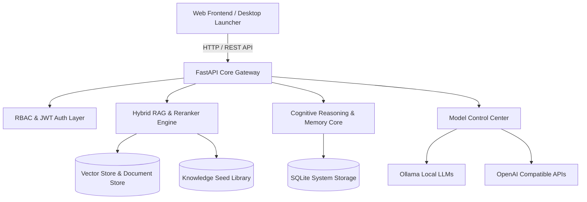

# 🇾🇪 Yemen AI Platform (v9.5) — Sovereign Bilingual Intelligence Core

[](https://python.org)
[](https://fastapi.tiangolo.com)
[](LICENSE)
[](#testing--verification)
[](#key-architectural-pillars)

> **Yemen AI Platform v9.5** is an enterprise-grade, sovereign bilingual (Arabic/English) intelligence ecosystem, featuring high-speed RAG (Retrieval-Augmented Generation), local model orchestration, multi-portal access management, adaptive memory graphs, and deep document research capabilities.

---

## 🌟 Key Features & Capabilities

- 🤖 **Multi-Provider AI Core Engine**: Seamlessly switch between local models (**Ollama**), **OpenAI-compatible APIs**, or internal offline fallbacks without application downtime.
- 📚 **Advanced RAG & Knowledge Engineering**: Multi-stage document chunking, semantic reranking, hybrid vector search, and citation provenance grounding.
- 🔬 **Document Research Workspace (Pro)**: Multi-document evidence comparison, page-aware outlines, and strict evidence-linked citations.
- 🔐 **Enterprise Access & Role Control**: Fine-grained Role-Based Access Control (RBAC) with JWT authentication covering User, Trainer, Developer, and Platform Admin portals.
- 🎨 **Modern Responsive UI**: Dark & Light high-contrast themes, dynamic RTL/LTR support, smooth micro-animations, and full desktop/mobile responsive drawers.
- 🧠 **Adaptive Cognitive Core & Memory Graph**: Context resolution, query analysis, conflict resolution, quality critic, and self-learning feedback loops.

---

## 🏗️ Architectural Overview



---

## 🚀 Quick Start & Installation

### Option 1: One-Click Launch (Windows)
Simply double-click the included batch launcher:
```cmd
RUN_YEMEN_AI.bat
```
*Automatically installs missing Python 3.13 dependencies and boots the FastAPI server.*

### Option 2: Manual Installation (Cross-Platform)

1. **Clone the repository**:
   ```bash
   git clone https://github.com/mghalaosimi-web/yemen-ai.git
   cd yemen-ai
   ```

2. **Set up virtual environment & dependencies**:
   ```bash
   python -m venv .venv
   source .venv/bin/activate  # On Windows: .venv\Scripts\activate
   pip install -r requirements.txt
   ```

3. **Configure Environment Variables (Optional)**:
   ```bash
   cp .env.example .env
   ```

4. **Launch Application Server**:
   ```bash
   uvicorn main:app --host 127.0.0.1 --port 8000 --reload
   ```
   Access the web platform at: **`http://127.0.0.1:8000`**

---

## 🐳 Docker Deployment

Deploy in containerized production environments effortlessly:

```bash
docker-compose up -d --build
```

---

## 🔑 Default Portal Access Credentials

| Role | Username | Default Password | Access Portal |
| :--- | :--- | :--- | :--- |
| **System Administrator** | `admin` | `YemenAI2026!` | Full System & Security Audit |
| **Developer** | `developer` | `YemenAI2026!` | Model Control & API Metrics |
| **Trainer** | `trainer` | `YemenAI2026!` | Bulk Ingestion & Knowledge Management |
| **User** | `user` | `YemenAI2026!` | AI Assistant & Document Workspace |

> ⚠️ *Important: Change default credentials and `YEMEN_AI_SECRET_KEY` before deploying to production environments.*

---

## 🧪 Testing & Verification

Run the full automated verification test suite:

```bash
pytest -v
```

- **186 Unit & Integration Tests**: 100% Passing.
- Coverage includes RBAC security gates, RAG retrieval quality, rate-limiting, concurrency, and UI contract consistency.

---

## 📄 License & Attribution

This project is licensed under the MIT License — see the [LICENSE](LICENSE) file for details.

Developed with precision for sovereign intelligence and bilingual knowledge representation.
